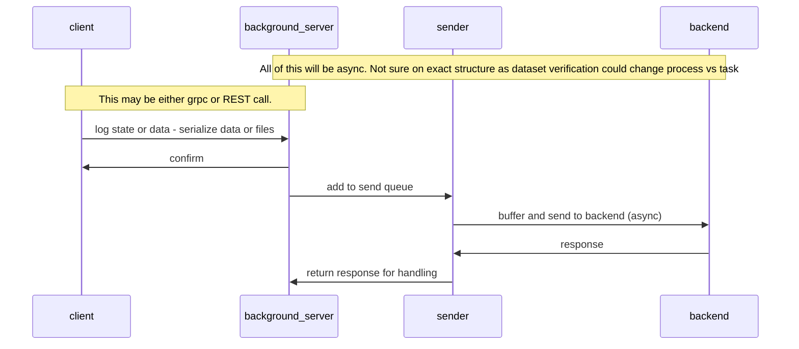
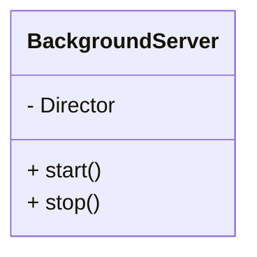

# Asynchronous Architecture

## Discovery

One client will initiate the background server - this is TBD the exact mechanism.
We can use the same as wandb and have a CLI that is called by the integration.
Alternatives are to spawn a process directly - but we need to find a way to separate 
it from the parent process and also make it discoverable to other client threads - in 
multithread/process training context.

Why do we care about one collection/sending point? To ensure consistency of the data
collected.

## Data logging process

## Class Diagram
