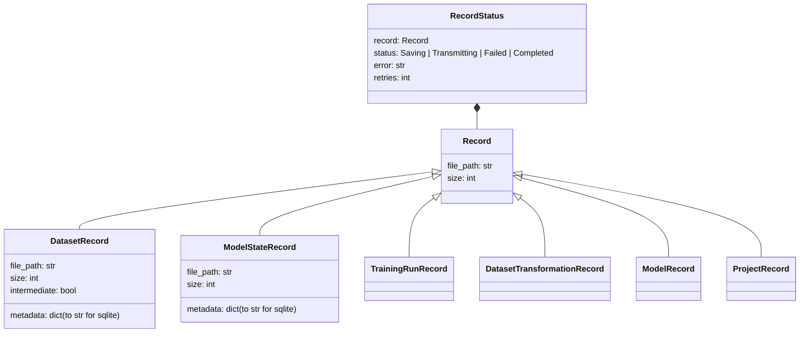
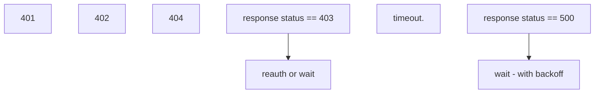

# Asynchronous Architecture

## Discovery

One client will initiate the background server - this is TBD the exact mechanism.
We can use the same as wandb and have a CLI that is called by the integration.
Alternatives are to spawn a process directly - but we need to find a way to separate 
it from the parent process and also make it discoverable to other client threads - in 
multithread/process training context.

Why do we care about one collection/sending point? To ensure consistency of the data
collected.

Major constraints are:
- Sequencing of various entities
  - training runs
  - datasets (parent child relationships)
  - model states 
- Validation 
  - metadata for datasets
  - uniqueness of some items (to avoid rejection by server)
- Consistency
  - must collect all data required and not lose except in major failure
  - ensure flow of information is correct - ie between datasets
- Prevent over requesting portal
  - Use circuit breaker pattern
  - Also use backoff when retrying
- Resource Usage
  - Try not to use too much memory
  - Try not to use too much storage
  - Need to allow user to provide limits on these that will then pause logging until free.
    - RC file?

We will use sqlite3 as a local persistent store. This will store various information about the records being processed
so that we can use them for clean up and ensuring consistency. 

We may also use it for circuit breaker pattern - but we can also use memory I think.

Need to decide whether to use cron or on restart for clean up of incomplete/failed requests.

Some wait for background to complete in the User Thread but should have timeout.

## Data logging process

## Persistence classes (internal)
These need to be serializable to JSON. Will need to deal with NaNs.
All the Record subclasses are optional - we can start with more generic Record and add subclasses
if they make sense for validation etc.

## External classes
We will also have classes for Users to use in their code. These will be added here.

## Network failure modes

